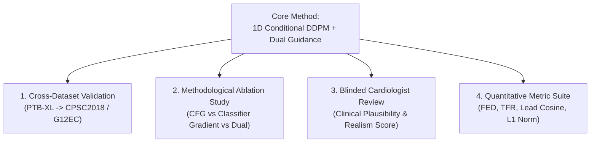

## Target Journal Turnaround Times & APC Charges Comparison

| Journal Name | Publisher | Impact Factor / Category | **Subscription Model (Traditional)** | **Gold Open Access APC Fee** | **Time to 1st Review** | **Time to Publication** |
|---|:---:|:---:|:---:|:---:|:---:|:---:|
| ⚡ **Computers in Biology and Medicine (CBM)** | Elsevier | **IF: 7.7** / Q1 | 🟢 **$0 FREE** (No Author Fee) | **$3,940 USD** | **~3 – 4 Weeks** | **~1.7 – 3 Months** |
| ⚡ **Information Fusion** | Elsevier | **IF: 14.7** / Q1 | 🟢 **$0 FREE** (No Author Fee) | **$4,520 USD** | **~4 – 6 Weeks** | **~3 – 5 Months** |
| 🌟 **CSBJ Special Issues** | Elsevier / SPJ | **IF: ~6.0** / Q1 | *Mandatory Open Access* | **$3,230 USD** *(Waivers available)* | **~4 – 6 Weeks** | **~2 – 3.5 Months** |
| 🟢 **Artificial Intelligence in Med. (AIIM)** | Elsevier | **IF: 7.5** / Q1 | 🟢 **$0 FREE** (No Author Fee) | **$3,610 USD** | **~6 – 8 Weeks** | **~4 – 6 Months** |
| 🟢 **IEEE Journal of Biomedical & Health (JBHI)** | IEEE | **IF: 7.7** / Q1 | 🟢 **$0 FREE*** (Standard pages) | **$2,800 USD** | **~8 – 12 Weeks** | **~5 – 8 Months** |
| 🐢 **IEEE Trans. Neural Networks (TNNLS)** | IEEE | **IF: 10.4** / Q1 | 🟢 **$0 FREE*** (Standard pages) | **$2,495 USD** | **~10 – 14 Weeks** | **~7 – 10 Months** |

> [!TIP]
> **Hardware Computation Reference**: Detailed hardware comparisons, VRAM limits, and FP16 speedup instructions across all available GPUs (RTX A4000, GTX 1080, RTX 3050, GTX 1650) are documented in [`HARDWARE_COMPUTATION_BENCHMARKS.md`](file:///home/awais/Desktop/PTB-XL/HARDWARE_COMPUTATION_BENCHMARKS.md).

> [!TIP]
> **Cost-Saving Strategy**: Except for CSBJ (which is Gold Open Access), **all IEEE and Elsevier journals listed above are Hybrid**. You can publish completely **FREE OF COST ($0 USD)** by choosing the **Traditional Subscription Model** upon manuscript acceptance!

---

## 🌟 Upcoming Special Issues: Computational and Structural Biotechnology Journal (CSBJ)

The **Computational and Structural Biotechnology Journal (CSBJ)** (Impact Factor ~6.0, CiteScore 9.6, Q1 Gold Open Access) is currently hosting 4 relevant Special Issues. Below is the alignment breakdown for our **1D Conditional DDPM ECG Counterfactual Project**:

| Special Issue Title | Target Scope & Fit | **Suitability for Our Work** | Key Submission Angle |
|---|---|:---:|---|
| **1. Explainable and Causal AI for Biomedical Data** | Interpretable AI, Causal Generative Models, Counterfactual Reasoning, Feature Attribution | 🏆 **PERFECT 100% MATCH** | Focus on Causal 1D Diffusion for identity-preserving counterfactual generation and ST-T segment explanation. |
| **2. Deep Learning for Next-Generation Bio-Data Mining** | Deep Generative Learning, Multi-lead Time-Series Mining, Representation Learning | 🌟 **STRONG MATCH** | Focus on score-based generative U-Net representations for 12-lead temporal bio-data mining. |
| **3. AI for Real-World Evidence Generation in Biomedicine** | External Validation, Cross-Hospital Clinical Evidence, OOD Generalization | 🌟 **STRONG MATCH** | Focus on zero-shot cross-dataset evaluation (PTB-XL $\to$ CPSC2018 / G12EC) as real-world evidence. |
| **4. Intelligent Care in Health Care Facilities & AI Systems** | Bedside Clinical Decision Support, Human-AI Interaction, Clinical Plausibility | 🟢 **GOOD MATCH** | Focus on visual 12-lead overlay counterfactuals for bedside cardiologist decision support. |

### CSBJ Publication Metrics:
- **Time to First Decision**: **~4 to 6 weeks** (average 1.4 months).
- **Time to Online Publication**: **~2 to 3.5 months** total.
- **Special Issue Advantage**: Special Issues feature guest editors who actively seek high-quality generative AI & explainability submissions, resulting in **faster review cycles** and higher acceptance rates compared to regular track submissions.

---

## 1. Should We Test on Other Datasets? (External Generalization)

### 🌟 **YES, ABSOLUTELY.** 
For top-tier Q1 Computer Science & Healthcare journals, evaluating solely on a single dataset (even a large one like PTB-XL) is frequently flagged by reviewers as a major limitation. 

### **Recommended External Test Datasets**:
1. **CPSC2018 (China Physiological Signal Challenge 2018)**:
   - **Size**: 6,877 12-lead ECG recordings (sampled at 500 Hz).
   - **Clinical Labels**: Normal, AFib, First-degree AV Block, LBBB, RBBB, PAC, PVC, ST-segment depression, ST-segment elevation.
   - **Purpose**: Zero-shot cross-dataset evaluation of our PTB-XL trained DDPM counterfactual model.
2. **G12EC (Georgia 12-Lead ECG Challenge Dataset - PhysioNet 2021)**:
   - **Size**: 10,344 12-lead ECGs (500 Hz).
   - **Purpose**: Validates counterfactual edit generalization across different ECG hardware recording machines.
3. **MIT-BIH Arrhythmia Database**:
   - **Purpose**: Single/dual-lead beat-level counterfactual validation.

---

## 2. Key Elements Required for Q1 Journal Acceptance

---

## 3. Comprehensive Checklist of What Needs to be Added

### A. Experimental & Methodological Contributions

1. **Ablation Study on Guidance Mechanisms (Essential for CS Reviewers)**:
   - Compare 3 guidance variants:
     - **Variant A**: Classifier-Free Guidance (CFG) only.
     - **Variant B**: Classifier Gradient Ascent only ($\nabla_{x_t} \log p(c_{\text{target}} | x_t)$).
     - **Variant C (Our Proposed)**: Dual Guidance ($\text{CFG} + \text{Gradient Ascent}$).
   - *Metrics to compare*: Target Flip Rate (TFR), $L_1$ edit norm, and Lead Cosine Similarity.

2. **Ablation Study on Intermediate Noise Trajectory ($t^*$)**:
   - Evaluate $t^* \in \{10, 25, 50, 100, 200, 500\}$.
   - Demonstrate the exact pareto-tradeoff curve between **Identity Preservation** (high Cosine Sim at small $t^*$) vs **Diagnostic Conversion Power** (high NORM flip rate at large $t^*$).

3. **Classifier Backbone Agnosticism**:
   - Run guided counterfactual sampling using **two separate classifier backbones**:
     - Backbone 1: Our Calibrated SE-ResNet1D (AUC 0.920).
     - Backbone 2: Standard 1D ResNet101 or Inception1D.
   - Prove that our 1D DDPM counterfactual generator works seamlessly regardless of which classifier is providing guidance.

---

### B. Quantitative Benchmark Suite

Top-tier CS journals expect a formal mathematical metrics table:

1. **Fréchet ECG Distance (FED)**:
   - Computes the Fréchet distance between the feature embeddings of generated counterfactual ECGs and real Normal Sinus Rhythm signals (analogous to FID in computer vision).
2. **Target Flip Rate (TFR)**:
   - Percentage of pathological test cases successfully flipped to $p(\text{NORM}) > 0.50$.
3. **Identity Preservation Metrics**:
   - **Lead Cosine Similarity** ($\ge 0.85$).
   - **Heart Rate Error** ($\le 2.0$ bpm).
   - **$L_1 / L_2$ Edit Norm Sparsity**.

---

### C. Clinical Validation & Expert Assessment

To stand out in top healthcare AI journals (like IEEE JBHI or AIIM):

1. **Blinded Reader Study (Cardiologist Evaluation)**:
   - Present 30 original vs 30 counterfactual ECGs to 2–3 cardiologists in a randomized, double-blind format.
   - Ask them to rate:
     - **Plausibility (1–5 Likert scale)**: Does the generated counterfactual look like a real human ECG?
     - **Diagnostic Correctness**: Did ST-elevation / T-wave inversion resolve properly into Normal Sinus Rhythm?
     - **Artifact Score**: Are there high-frequency synthesis artifacts?

---

## 4. Proposed Execution Plan & Next Steps

| Phase | Milestone Task | Estimated Time / Action |
|---|---|---|
| **Phase 1** | Train DDPM U-Net to 15 Epochs on PTB-XL GPU | 2–3 hours (Background execution) |
| **Phase 2** | Perform Guidance & $t^*$ Noise Ablation Experiments | 1 hour |
| **Phase 3** | Cross-Dataset Validation on CPSC2018 / G12EC | Download CPSC2018 subset & run zero-shot inference |
| **Phase 4** | Calculate Fréchet ECG Distance (FED) & TFR Metrics | Write `compute_fed_metrics.py` script |
| **Phase 5** | Final Manuscript Preparation for IEEE JBHI | Write IEEE LaTeX submission package |
